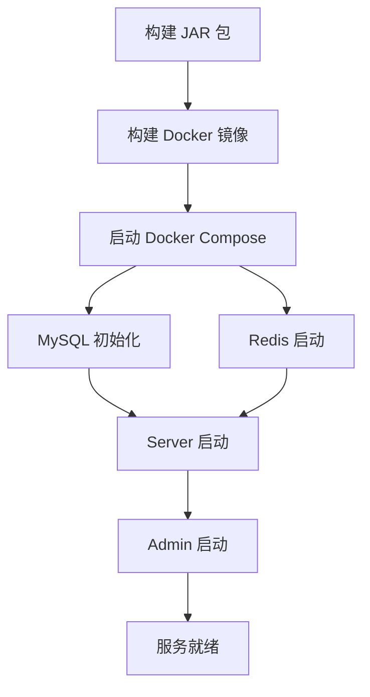
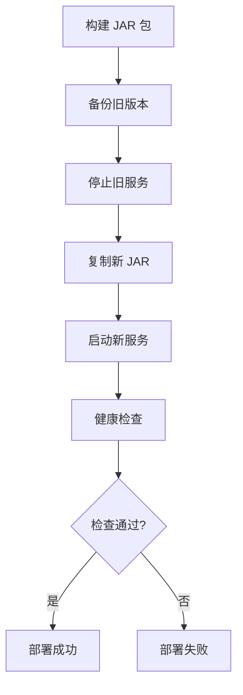

# Docker 部署配置与脚本分析报告

## 一、Docker 配置文件概览

### 1.1 文件结构

```
项目根目录/
├── yudao-server/
│   └── Dockerfile                    # 后端服务 Docker 镜像构建文件
├── script/
│   ├── docker/
│   │   ├── docker-compose.yml        # Docker Compose 编排文件（主）
│   │   ├── docker.env                # 环境变量配置文件
│   │   └── Docker-HOWTO.md           # Docker 使用说明文档
│   ├── shell/
│   │   └── deploy.sh                 # 传统部署脚本（非 Docker）
│   └── jenkins/
│       └── Jenkinsfile               # Jenkins CI/CD 流水线配置
└── sql/tools/
    └── docker-compose.yaml           # 数据库测试环境 Docker Compose 文件
```

## 二、Dockerfile 分析

### 2.1 后端服务 Dockerfile (`yudao-server/Dockerfile`)

**基础镜像**:
- `eclipse-temurin:8-jre` - Eclipse Temurin JDK 8 JRE
- 选择原因：AdoptOpenJDK 停止发布，Eclipse Temurin 是稳定替代方案

**镜像特点**:
- ✅ 使用 JRE 而非 JDK，镜像体积更小
- ✅ 设置时区为 `Asia/Shanghai`
- ✅ 默认 JVM 参数：`-Xms512m -Xmx512m`
- ✅ 支持通过环境变量覆盖 JVM 参数
- ✅ 暴露端口：48080

**构建步骤**:
1. 创建工作目录 `/yudao-server`
2. 复制编译好的 JAR 包到镜像
3. 设置环境变量
4. 启动命令：`java ${JAVA_OPTS} -jar app.jar $ARGS`

**优化建议**:
- ⚠️ 缺少 `.dockerignore` 文件，可能导致构建上下文过大
- ⚠️ 未使用多阶段构建，可以进一步优化镜像大小
- ⚠️ 未设置非 root 用户运行（安全性考虑）
- ⚠️ 未配置健康检查

## 三、Docker Compose 配置分析

### 3.1 主 Docker Compose 文件 (`script/docker/docker-compose.yml`)

**版本**: Docker Compose 3.4

**服务组成**:
1. **mysql** - MySQL 8 数据库
2. **redis** - Redis 6 Alpine 版本
3. **server** - 后端服务（需要构建）
4. **admin** - 前端管理后台（需要构建）

#### 3.1.1 MySQL 服务配置

**配置分析**:
- 镜像：`mysql:8`
- 容器名：`yudao-mysql`
- 端口映射：`3306:3306`
- 数据持久化：使用命名卷 `mysql`
- 初始化脚本：自动执行 `ruoyi-vue-pro.sql`
- 环境变量：
  - `MYSQL_DATABASE`: 默认 `ruoyi-vue-pro`
  - `MYSQL_ROOT_PASSWORD`: 默认 `123456`

**特点**:
- ✅ 支持通过环境变量配置数据库名和密码
- ✅ 自动初始化数据库脚本
- ✅ 数据持久化到 Docker 卷

**安全建议**:
- ⚠️ 默认密码过于简单（123456），生产环境需要修改
- ⚠️ 端口直接暴露到宿主机，建议使用内部网络

#### 3.1.2 Redis 服务配置

**配置分析**:
- 镜像：`redis:6-alpine`（轻量级）
- 容器名：`yudao-redis`
- 端口映射：`6379:6379`
- 数据持久化：使用命名卷 `redis`

**特点**:
- ✅ 使用 Alpine 版本，镜像体积小
- ✅ 数据持久化
- ⚠️ 未配置密码认证（生产环境需要）

#### 3.1.3 Server 服务配置

**配置分析**:
- 构建上下文：`./yudao-server/`
- 容器名：`yudao-server`
- 端口映射：`48080:48080`
- 环境变量：
  - `SPRING_PROFILES_ACTIVE`: `local`
  - `JAVA_OPTS`: 默认 `-Xms512m -Xmx512m`
  - `ARGS`: Spring Boot 启动参数（数据源、Redis 配置）

**数据源配置**:
- 主从数据源配置（支持读写分离）
- 通过环境变量动态配置连接信息
- 默认连接 Docker 网络内的 MySQL 服务

**依赖关系**:
- `depends_on`: mysql, redis（确保启动顺序）

**特点**:
- ✅ 支持通过环境变量覆盖配置
- ✅ 自动连接到 Docker 网络内的 MySQL 和 Redis
- ⚠️ 使用 `local` 环境配置，可能不适合生产环境

#### 3.1.4 Admin 服务配置

**配置分析**:
- 构建上下文：`./yudao-ui-admin/`
- 容器名：`yudao-admin`
- 端口映射：`8080:80`
- 构建参数：多个 Vue 环境变量

**前端环境变量**:
- `NODE_ENV`: production
- `VUE_APP_TITLE`: 芋道管理系统
- `VUE_APP_BASE_API`: /prod-api
- `VUE_APP_TENANT_ENABLE`: true
- `VUE_APP_CAPTCHA_ENABLE`: true
- `VUE_APP_DOC_ENABLE`: true

**特点**:
- ✅ 支持构建时注入环境变量
- ✅ 使用 Nginx 作为 Web 服务器
- ⚠️ 需要前端 Dockerfile（未在当前目录看到）

### 3.2 数据库测试环境 Docker Compose (`sql/tools/docker-compose.yaml`)

**用途**: 提供多种数据库的测试环境

**支持的数据库**:
1. **MySQL 8.0.33**
2. **PostgreSQL 14.2**
3. **Oracle XE 18** (gvenzl/oracle-xe:18-slim-faststart)
4. **Oracle 19c** (einslib/oracle-19c:19.3.0-ee-slim-faststart)
5. **SQL Server 2017** (mcr.microsoft.com/mssql/server:2017-latest)
6. **达梦 DM8** (需要手动加载镜像)
7. **人大金仓 Kingbase** (需要手动加载镜像)
8. **OpenGauss 5.0.0**

**配置特点**:
- ✅ 覆盖主流数据库，便于测试
- ✅ 每个数据库都有数据持久化卷
- ✅ 自动初始化脚本支持
- ⚠️ 部分数据库镜像需要手动加载（达梦、人大金仓）

**端口映射**:
- MySQL: 3306
- PostgreSQL: 5432
- Oracle: 1521
- SQL Server: 1433
- 达梦 DM8: 5236
- 人大金仓: 54321
- OpenGauss: 5432

## 四、环境变量配置分析

### 4.1 docker.env 文件

**配置内容**:
- MySQL 数据库配置
- 数据源连接配置（主从）
- Redis 连接配置
- 前端环境变量

**特点**:
- ✅ 集中管理环境变量
- ✅ 支持变量引用（如 `${MYSQL_ROOT_PASSWORD}`）
- ✅ 可通过 `--env-file` 参数加载

**使用方式**:
```bash
docker compose --env-file docker.env up -d
```

## 五、部署脚本分析

### 5.1 传统部署脚本 (`script/shell/deploy.sh`)

**脚本功能**:
1. **备份** (`backup`): 备份现有 JAR 包
2. **停止** (`stop`): 优雅停止 Java 服务
3. **转移** (`transfer`): 复制新 JAR 包到部署目录
4. **启动** (`start`): 启动 Java 服务
5. **健康检查** (`healthCheck`): 检查服务是否正常启动

**配置参数**:
- `BASE_PATH`: `/work/projects/yudao-server`
- `SERVER_NAME`: `yudao-server`
- `PROFILES_ACTIVE`: `development`
- `HEALTH_CHECK_URL`: `http://127.0.0.1:48080/actuator/health/`
- `JAVA_OPS`: `-Xms512m -Xmx512m -XX:+HeapDumpOnOutOfMemoryError`

**特点**:
- ✅ 支持优雅关闭（kill -15）
- ✅ 支持强制关闭（kill -9）
- ✅ 健康检查机制（最多等待 120 秒）
- ✅ 自动备份旧版本
- ✅ 支持 SkyWalking Agent（已注释）
- ✅ 支持堆转储配置

**停止策略**:
1. 首先尝试 `kill -15`（SIGTERM）优雅关闭
2. 等待最多 120 秒
3. 如果仍未关闭，使用 `kill -9` 强制关闭

**健康检查策略**:
1. 通过 `curl` 检查 `/actuator/health/` 端点
2. 最多重试 120 次（每次间隔 1 秒）
3. 如果检查失败，输出日志并退出

**优化建议**:
- ⚠️ 硬编码路径，建议使用环境变量
- ⚠️ 健康检查超时时间较长（120 秒），可根据实际情况调整
- ✅ 已考虑堆转储，便于问题排查

### 5.2 Jenkins CI/CD 配置 (`script/jenkins/Jenkinsfile`)

**流水线阶段**:
1. **检出**: 从 Git 仓库拉取代码
2. **构建**: Maven 编译打包
3. **部署**: 复制文件并执行部署脚本

**特点**:
- ✅ 支持参数化构建（TAG_NAME）
- ✅ 支持多环境配置替换
- ✅ 支持 Docker Hub 和 Kubernetes（配置但未使用）
- ⚠️ 硬编码路径和凭证 ID，需要根据实际情况修改

**环境变量**:
- `DOCKER_CREDENTIAL_ID`: Docker Hub 凭证
- `GITHUB_CREDENTIAL_ID`: GitHub 凭证
- `KUBECONFIG_CREDENTIAL_ID`: Kubernetes 凭证
- `APP_DEPLOY_BASE_DIR`: 部署基础目录

**构建步骤**:
1. 替换配置文件（如果存在）
2. Maven 编译打包（跳过测试）
3. 复制部署脚本和 JAR 包
4. 执行部署脚本

## 六、Docker 使用文档分析

### 6.1 Docker-HOWTO.md

**文档内容**:
- Docker Compose 使用说明
- JAR 包构建方法（使用 Docker）
- 服务启动方法
- 端口映射说明

**构建 JAR 包方法**:
使用 Docker 运行 Maven 容器进行构建，避免本地安装 Maven：
```bash
docker volume create --name yudao-maven-repo
docker run -it --rm --name yudao-maven \
    -v yudao-maven-repo:/root/.m2 \
    -v $PWD:/usr/src/mymaven \
    -w /usr/src/mymaven \
    maven mvn clean install package '-Dmaven.test.skip=true'
```

**特点**:
- ✅ 使用 Docker Volume 缓存 Maven 依赖
- ✅ 无需本地安装 Maven
- ✅ 跨平台兼容

## 七、配置分析与评估

### 7.1 优点

1. **完整的 Docker 化支持**
   - 后端服务、前端、数据库、缓存都有 Docker 配置
   - 支持一键启动整个系统

2. **灵活的配置管理**
   - 支持环境变量覆盖
   - 支持 `.env` 文件配置
   - 支持多环境配置

3. **数据持久化**
   - MySQL 和 Redis 都使用 Docker 卷持久化
   - 数据不会因容器重启而丢失

4. **自动化部署**
   - Jenkins 流水线支持
   - 部署脚本支持优雅关闭和健康检查

5. **多数据库支持**
   - 提供多种数据库的测试环境
   - 便于跨数据库测试

### 7.2 改进建议

#### 7.2.1 安全性

1. **密码管理**
   - ⚠️ 默认密码过于简单，建议使用强密码
   - ⚠️ 建议使用 Docker Secrets 或环境变量管理敏感信息
   - ⚠️ Redis 未配置密码认证

2. **网络安全**
   - ⚠️ 数据库端口直接暴露，建议使用内部网络
   - ⚠️ 建议配置防火墙规则

3. **镜像安全**
   - ⚠️ 建议使用非 root 用户运行容器
   - ⚠️ 建议定期更新基础镜像

#### 7.2.2 性能优化

1. **资源限制**
   - ⚠️ 未配置 CPU 和内存限制
   - 建议添加 `deploy.resources` 配置

2. **健康检查**
   - ⚠️ Dockerfile 中未配置健康检查
   - 建议添加 `HEALTHCHECK` 指令

3. **镜像优化**
   - ⚠️ 建议使用多阶段构建减小镜像体积
   - ⚠️ 建议添加 `.dockerignore` 文件

#### 7.2.3 可维护性

1. **日志管理**
   - ⚠️ 未配置日志驱动
   - 建议使用 `json-file` 或 `syslog` 驱动

2. **监控**
   - ⚠️ 未配置监控和告警
   - 建议集成 Prometheus 等监控工具

3. **备份策略**
   - ⚠️ 未配置自动备份
   - 建议添加数据库备份脚本

#### 7.2.4 生产环境建议

1. **环境分离**
   - ⚠️ 使用 `local` 环境配置，不适合生产
   - 建议创建 `production` 环境配置

2. **高可用**
   - ⚠️ 单实例部署，无高可用保障
   - 建议配置多实例和负载均衡

3. **资源规划**
   - ⚠️ JVM 参数固定，建议根据实际负载调整
   - 建议配置 JVM 调优参数

## 八、部署流程分析

### 8.1 Docker 部署流程



**步骤**:
1. 构建 JAR 包（Maven 或 Docker）
2. 构建 Docker 镜像（`docker compose build`）
3. 启动服务（`docker compose up -d`）
4. 等待服务就绪

### 8.2 传统部署流程



**步骤**:
1. 构建 JAR 包
2. 执行部署脚本（`deploy.sh`）
3. 脚本自动执行：备份 → 停止 → 转移 → 启动 → 健康检查

## 九、端口映射总结

| 服务 | 容器端口 | 宿主机端口 | 说明 |
|------|---------|-----------|------|
| MySQL | 3306 | 3306 | 数据库服务 |
| Redis | 6379 | 6379 | 缓存服务 |
| Server | 48080 | 48080 | 后端 API 服务 |
| Admin | 80 | 8080 | 前端管理后台 |

## 十、数据卷管理

### 10.1 命名卷

- `mysql`: MySQL 数据持久化
- `redis`: Redis 数据持久化

### 10.2 数据备份建议

建议定期备份 Docker 卷：
```bash
# 备份 MySQL 数据
docker run --rm -v yudao-system_mysql:/data -v $(pwd):/backup \
    alpine tar czf /backup/mysql-backup-$(date +%Y%m%d).tar.gz /data

# 备份 Redis 数据
docker run --rm -v yudao-system_redis:/data -v $(pwd):/backup \
    alpine tar czf /backup/redis-backup-$(date +%Y%m%d).tar.gz /data
```

## 十一、总结

### 11.1 配置完整性

✅ **优点**:
- Docker 配置完整，覆盖所有服务
- 支持多种部署方式（Docker、传统部署）
- 提供详细的文档说明
- 支持多数据库测试环境

### 11.2 生产就绪度

⚠️ **需要改进**:
- 安全性配置需要加强（密码、网络、权限）
- 缺少监控和日志管理
- 缺少资源限制和健康检查
- 需要优化镜像大小和构建速度

### 11.3 适用场景

**当前配置适合**:
- ✅ 开发环境快速部署
- ✅ 测试环境验证
- ✅ 演示环境展示
- ✅ 小规模生产环境（需要改进后）

**不适合**:
- ❌ 大规模生产环境（需要高可用、监控等）
- ❌ 高并发场景（需要优化和扩展）

---

**分析时间**: 2025年  
**分析范围**: Docker 配置文件、部署脚本、CI/CD 配置  
**分析深度**: 配置分析、安全性评估、性能优化建议、生产环境建议


